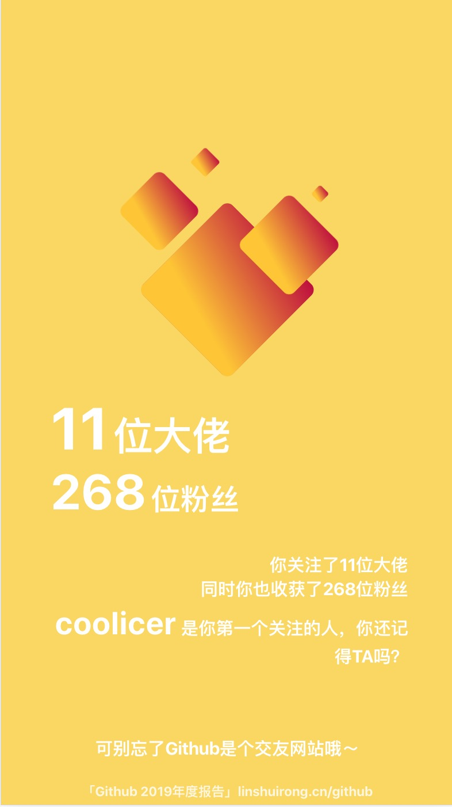
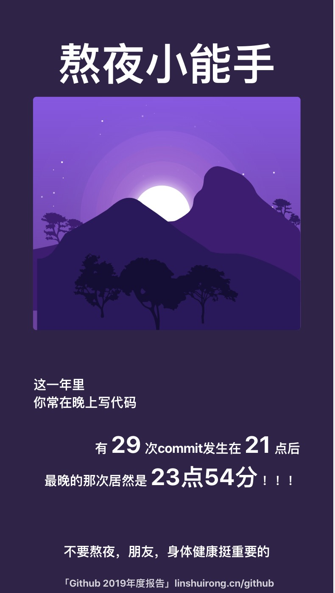
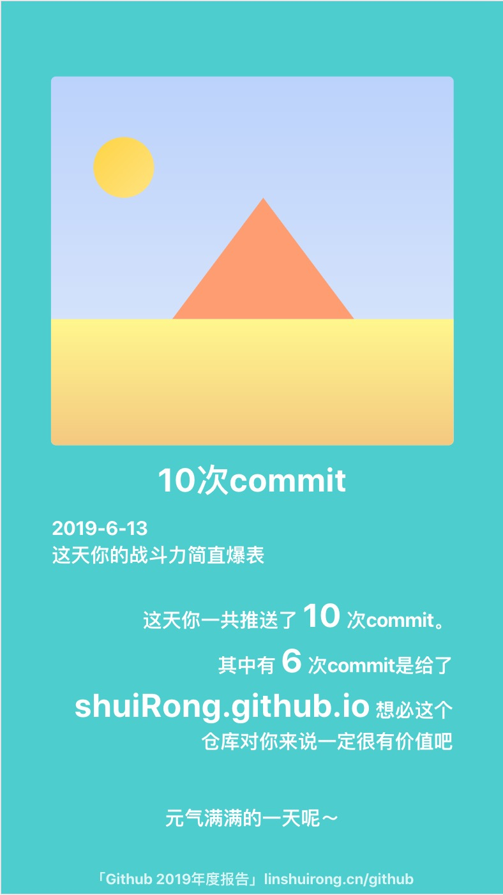
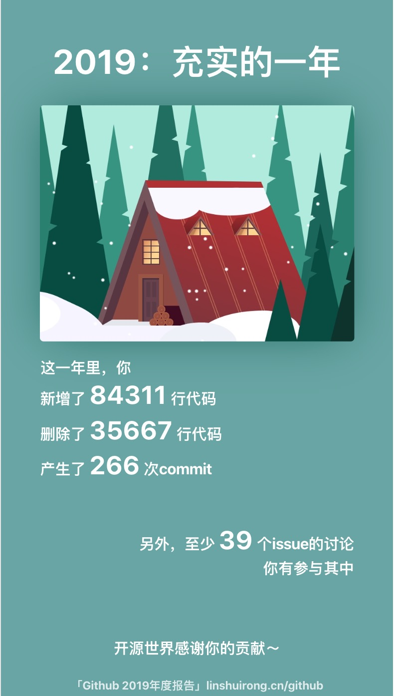

### Github Annual Report 2019｜Github 年度报告 2019

**2019年过去了，**

**我很怀念它。**

 

**在过去的一年中，**

**你写了多少行代码？**

**删除了多少行代码？**

**提交了多少次commit？**

**在issue区参与了多少次讨论？**

**关注了多少个大佬？**

**收获了多少个支持者？**

**创建了多少个仓库？（待实现）**

**参加了多少个组织？（待实现）**

 

**让我来帮助你回忆～**

[年度报告传送门](https://linshuirong.cn/github/)

**Previews**

|  |  |  |
| -------------------------- | -------------------------- | -------------------------- |
|  |  |  |

